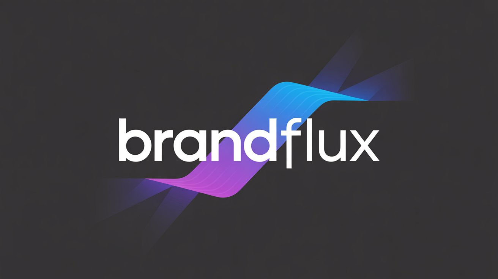
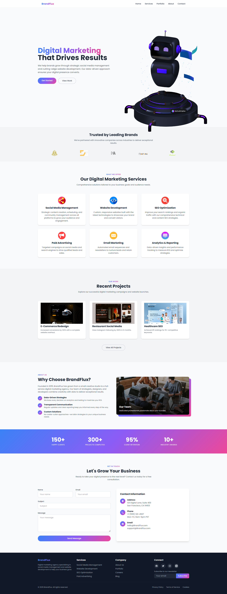
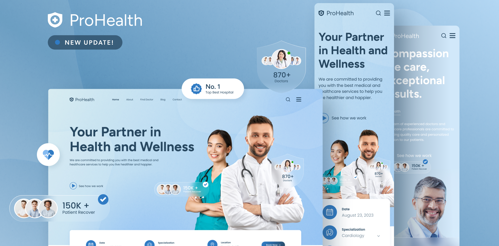

# BrandFlux 🎯
> Your Strategic Partner in Digital Marketing Excellence

> [View Live Demo](https://mahmoud-ath.github.io/Websites/Projects_site/BrandFlux/index.html)




## 📋 Table of Contents
- [Overview](#overview)
- [Key Features](#key-features)
- [Portfolio Showcase](#portfolio-showcase)
- [Tech Stack](#tech-stack)
- [Getting Started](#getting-started)
- [Usage](#usage)
- [Contributing](#contributing)
- [Testing](#testing)
- [Deployment](#deployment)
- [License](#license)
- [Contact](#contact)
- [Roadmap](#roadmap)

## 🚀 Overview
BrandFlux is a comprehensive digital marketing agency website that bridges the gap between businesses and their digital success. We specialize in creating impactful digital marketing strategies, stunning web designs, and data-driven solutions.

### Purpose & Solution
- **Problem**: Businesses struggle to establish and maintain a strong digital presence in today's competitive market
- **Solution**: Providing end-to-end digital marketing services with measurable results
- **Impact**: Helping businesses achieve sustainable growth through strategic digital initiatives

### Target Audience
- Small to medium-sized businesses
- Startups and entrepreneurs
- E-commerce businesses
- Service-based companies
- Local businesses seeking digital expansion

## ✨ Key Features
- 🎯 Strategic Digital Marketing Services
- 🎨 Professional Web Design & Development
- 📊 Data Analytics & Reporting
- 🔍 Search Engine Optimization (SEO)
- 📱 Social Media Management
- 💡 Brand Strategy & Development
- 📈 Performance Marketing
- 🤝 Client Support Portal
## 📸 Screenshots


## 📸 Portfolio Showcase




## 🛠 Tech Stack
### Frontend
- HTML5
- CSS3 with modern animations
- JavaScript (ES6+)
- Responsive design principles
- CSS Grid & Flexbox
- Tailwind CSS (via CDN)
- GSAP (GreenSock Animation Platform)
- Three.js (required by Spline)
- Spline Viewer (3D asset integration)
- Google Fonts (Poppins)
### Tools & Libraries
- spline 3D
- Font Awesome Icons
- Google Fonts
- Custom CSS animations
- Mobile-first approach

## 🚀 Getting Started

### Prerequisites
- Any modern web browser
- Basic understanding of web technologies
- Text editor (VS Code recommended)

### Installation
1. Clone the repository:
```bash
git clone https://github.com/mahmoud-ath/Websites.git
```

2. Navigate to project directory:
```bash
cd Websites/Projects_site/BrandFlux
```

3. Open index.html in your browser or use a local server


## 💻 Usage
1. Customize the content:
   - Edit text in `index.html`
   - Modify styles in `style.css`
   - Update scripts in `script.js`

2. Replace images:
   - Add your portfolio images to `/img`
   - Update image paths in HTML
   - Maintain aspect ratios for consistency

3. Configure contact forms:
   - Update form action URLs
   - Test form submissions
   - Set up email notifications

## 🤝 Contributing
We welcome contributions! Here's how you can help:

1. Fork the repository
2. Create a feature branch
```bash
git checkout -b feature/YourFeature
```
3. Commit your changes
```bash
git commit -m 'Add some amazing feature'
```
4. Push to the branch
```bash
git push origin feature/YourFeature
```
5. Open a Pull Request

## 🧪 Testing
### Visual Testing
- Test responsiveness on all devices
- Check all animations and transitions
- Verify form validations
- Test navigation and links

### Performance Testing
- Run Lighthouse audits
- Check page load times
- Validate HTML/CSS
- Test cross-browser compatibility

## 📦 Deployment
Deploy to your preferred hosting:

1. **Static Hosting**
   - Netlify
   - Vercel
   - GitHub Pages

2. **Traditional Hosting**
   - Upload via FTP
   - Configure domain settings
   - Set up SSL certificate

## 📝 License
This project is licensed under the MIT License - see the [LICENSE](LICENSE) file for details.

## 📞 Contact
Mahmoud Ath - [GitHub Profile](https://github.com/mahmoud-ath)

## 🗺 Recomendation
### Short-term
- [ ] Add dark/light theme toggle
- [ ] Implement blog section
- [ ] Add client testimonials carousel
- [ ] Enhance portfolio filters

### Long-term
- [ ] Add multi-language support
- [ ] Develop client dashboard
- [ ] Create case studies section
- [ ] Implement chat support
- [ ] Add AI-powered recommendations

---

Made with ❤️ by [Mahmoud Ath](https://github.com/mahmoud-ath)
