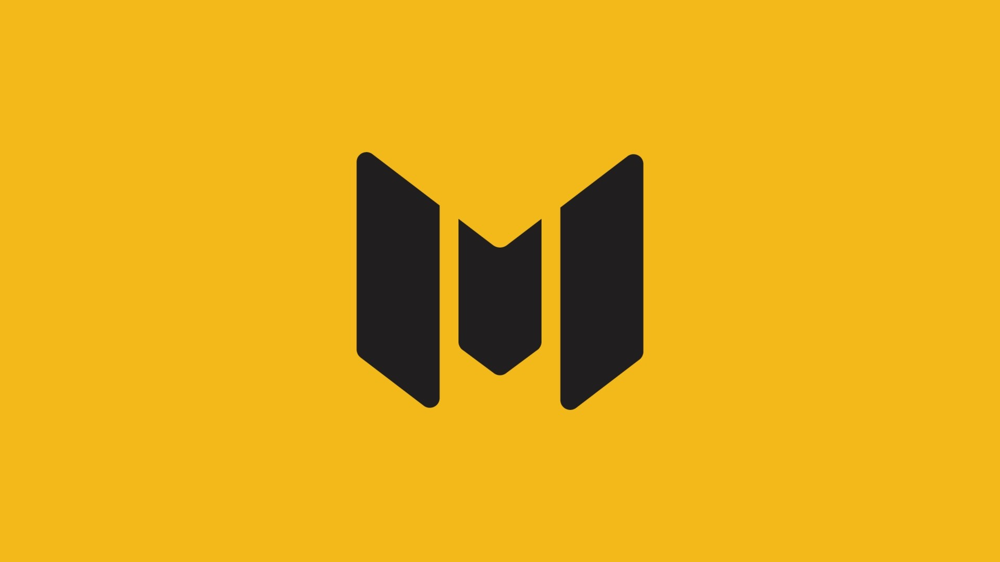
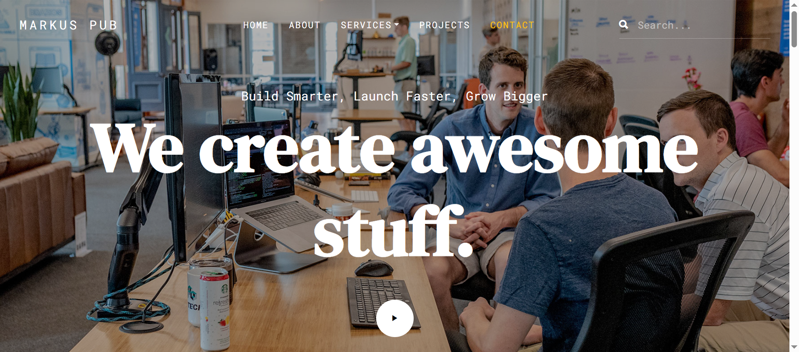

# MarkusPub Portfolio 🎨 
### Your Professional Digital Showcase
> 

[](https://opensource.org/licenses/MIT)

[View Live Demo](https://mahmoud-ath.github.io/Websites/Projects_site/MarkusPub/index.html) 

 

## 📋 Table of Contents
- [About](#about)
- [Features](#features)
- [Screenshots](#screenshots)
- [Technical Details](#technical-details)
- [Installation](#installation)
- [Usage](#usage)
- [Contributing](#contributing)
- [Testing](#testing)
- [Deployment](#deployment)
- [License](#license)
- [Contact](#contact)
- [Roadmap](#roadmap)

## 🎯 About
MarkusPub is a modern, responsive portfolio website designed to showcase professional work, projects, and services. Built with a focus on clean design and user experience, it serves as a powerful platform for presenting your professional journey and achievements.

### Purpose
- Create a professional online presence
- Showcase portfolio projects and services
- Provide an easy way for potential clients to learn about your work
- Enable seamless contact and communication

### Target Audience
- Potential clients and employers
- Fellow professionals
- Design enthusiasts
- Project collaborators

## ✨ Features
- Responsive modern design that works on all devices
- Dynamic portfolio showcase with project details
- Smooth animations and transitions
- Contact form for easy communication
- Service showcase section
- About section with professional background
- Project categorization and filtering
- Image galleries with lightbox functionality

## 📸 Screenshots



## 🛠️ Technical Details

### Architecture
The project follows a clean, modular architecture with separate concerns for styling, scripting, and content.

### Tech Stack
- HTML5
- CSS3/SCSS
- JavaScript (ES6+)
- Bootstrap 4
- jQuery

### Libraries and Frameworks
- AOS (Animate on Scroll)
- Owl Carousel
- Fancybox
- Font Awesome
- Flaticon
- jQuery Waypoints
- Stellar.js

## 📥 Installation

### Prerequisites
- Web browser
- Local development server (optional)

### Steps to Run Locally
### Local Setup
1. Clone the repository:
```bash
git clone https://github.com/mahmoud-ath/Websites.git
```

2. Navigate to project directory:
```bash
cd Websites/Projects_site/MarkusPub
```

3. Open index.html in your browser or use a local server

## 🚀 Usage
1. Navigate through the website using the main menu
2. Browse portfolio items in the Projects section
3. View detailed project information by clicking on portfolio items
4. Use the contact form to send messages
5. Explore services and about sections for more information

## 👥 Contributing
Contributions are welcome! Here's how you can help:

1. Fork the repository
2. Create a feature branch
```bash
git checkout -b feature/YourFeature
```
3. Commit your changes
```bash
git commit -m 'Add some feature'
```
4. Push to the branch
```bash
git push origin feature/YourFeature
```
5. Open a Pull Request

## 🧪 Testing
1. Test responsive design using browser dev tools
2. Validate HTML using W3C Validator
3. Check JavaScript console for errors
4. Verify all links and forms are working
5. Test across different browsers

## 📦 Deployment
The website can be deployed to any web hosting service:

1. Purchase hosting and domain
2. Upload files via FTP or hosting control panel
3. Configure domain settings
4. Test the live site

## 📄 License
This project is licensed under the MIT License - see the [LICENSE](LICENSE) file for details.

## 📞 Contact
Mahmoud Ath - [GitHub Profile](https://github.com/mahmoud-ath)

## 🗺️ Roadmap
- [ ] Add dark/light theme toggle
- [ ] Implement blog section
- [ ] Add project filtering by category
- [ ] Integrate CMS for easier content management
- [ ] Add multi-language support
- [ ] Implement PWA features

---

⭐️ If you found this project helpful, please consider giving it a star!

---

Made with ❤️ by [Mahmoud Ath](https://github.com/mahmoud-ath)
