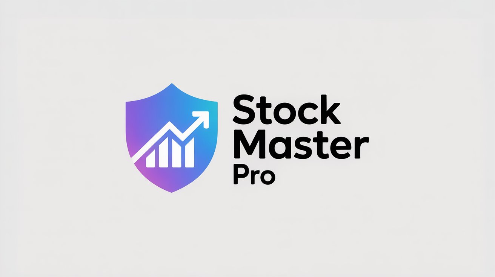
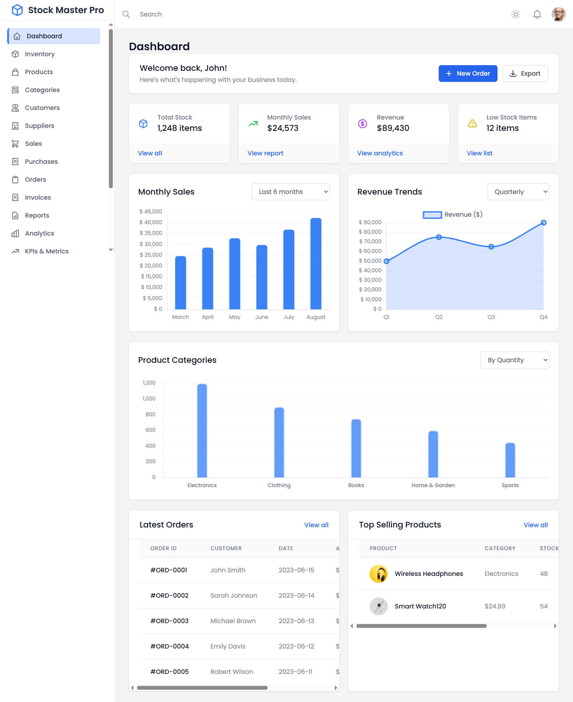

# 📈 StockMasterPro

> A powerful, interactive stock visualization platform for real-time market analysis and trend tracking.

>[View Live Demo](https://mahmoud-ath.github.io/Websites/Projects_site/StockMasterPro/StockMasterPro.html)

 


[](https://choosealicense.com/licenses/mit/)

## 📋 Table of Contents

- [About](#about)
- [Features](#features)
- [Screenshots](#screenshots)
- [Technical Details](#technical-details)
- [Installation](#installation)
- [Usage](#usage)
- [Contributing](#contributing)
- [Testing](#testing)
- [Deployment](#deployment)
- [License](#license)
- [Contact](#contact)
- [Roadmap](#roadmap)

## 🎯 About

StockMasterPro is a modern web application designed to provide investors and traders with powerful stock visualization tools. It offers both bar and line chart representations of stock data, enabling users to analyze market trends and make informed investment decisions.

### Purpose
- Simplify stock market data visualization
- Provide interactive charting tools for market analysis
- Enable better decision-making through clear data representation

### Target Audience
- Individual investors
- Day traders
- Financial analysts
- Investment professionals
- Anyone interested in stock market visualization

## ✨ Features

- 📊 Interactive bar charts for volume analysis
- 📈 Dynamic line charts for price tracking
- 🔄 Real-time data updates
- 📱 Responsive design for all devices
- 🎨 Customizable chart appearance
- 🔍 Zoom and pan capabilities
- 💾 Data export functionality

## 📸 Screenshots




## 🔧 Technical Details

### Architecture
The application follows a client-side architecture with modular JavaScript components:
- `StockMasterPro.html`: Main entry point and layout structure
- `script_line_chart.js`: Line chart visualization logic
- `categoriesChart.js & salesChart.js`: Bar chart visualization logic
- `style.css`: Styling and responsive design

### Tech Stack
- HTML5
- CSS3
- JavaScript (ES6+)

### Libraries & Frameworks
- Chart visualization library 
- Modern CSS framework for styling
- JavaScript utility libraries

### Local Setup
1. Clone the repository:
```bash
git clone https://github.com/mahmoud-ath/Websites.git
```

2. Navigate to project directory:
```bash
cd Websites/Projects_site/StockMasterPro
```
3. Open index.html in your browser or use a local server

### Dependencies
- Modern web browser (Chrome, Firefox, Safari, Edge)
- Internet connection for real-time data (if applicable) (Upcoming Features)

## 💻 Usage (Upcoming Features )

1. Open the application in your web browser
2. Select the desired stock symbol
3. Choose between bar chart or line chart visualization
4. Use the interactive controls to:
   - Zoom in/out
   - Pan across different time periods
   - Toggle data overlays
   - Export chart data

## 🤝 Contributing

We welcome contributions to StockMasterPro! Please follow these steps:

1. Fork the repository
2. Create a feature branch (\`git checkout -b feature/AmazingFeature\`)
3. Commit your changes (\`git commit -m 'Add some AmazingFeature'\`)
4. Push to the branch (\`git push origin feature/AmazingFeature\`)
5. Open a Pull Request

## 🧪 Testing

Run tests using your browser's developer tools:
1. Open the console
2. Check for any JavaScript errors
3. Verify chart rendering
4. Test responsive design across different screen sizes

## 📦 Deployment

The application can be deployed on any web server or hosting platform:
1. Upload all files to your web server
2. Ensure proper file permissions
3. Access through the domain/subdomain of your choice

## 📄 License

Distributed under the MIT License. See `LICENSE` file for more information.

## 📞 Contact
Mahmoud Ath - [GitHub Profile](https://github.com/mahmoud-ath)

## 🛣️ Roadmap Upcoming Features

- [ ] Add additional chart types
- [ ] Implement real-time data streaming
- [ ] Add user authentication
- [ ] Include advanced technical indicators
- [ ] Develop mobile app version
- [ ] Add portfolio tracking features
- [ ] Implement social sharing capabilities

---

⭐️ If you find StockMasterPro useful, please consider giving it a star!

---

Made with ❤️ by [Mahmoud Ath](https://github.com/mahmoud-ath)
