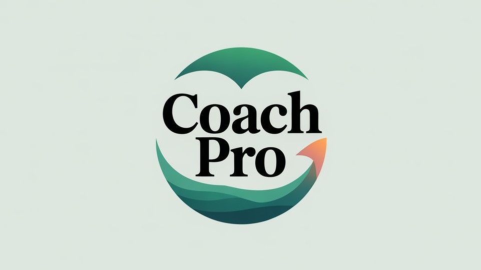
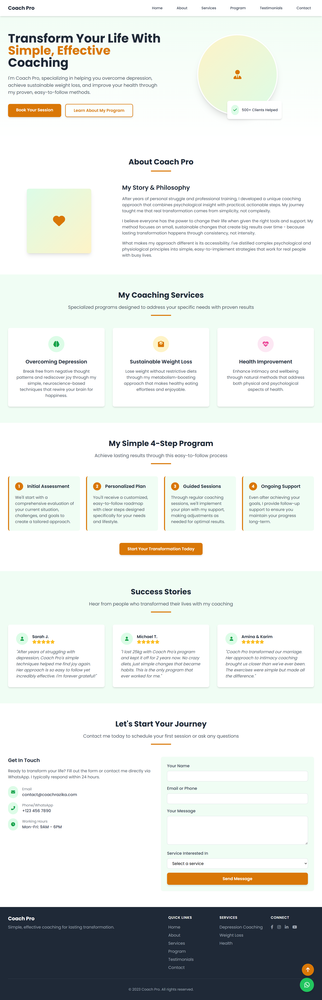

# 🏆 CoachPro – Life Transformation Specialist

**Live Demo:** [View CoachPro](https://mahmoud-ath.github.io/Websites/Projects_site/coachPro/coachPro.html)  
**Tagline:** *Simple, effective coaching for lasting transformation.*

---

## 📌 Logo / Banner


---

## 📊 Badges

[](LICENSE)

---

## 📖 Table of Contents
1. [About the Project](#about-the-project)
2. [Features](#features--highlights)
3. [Screenshots](#screenshots-or-demo-placeholders)
4. [Technical Details](#technical-details)
5. [Installation](#installation-instructions)
6. [Usage](#usage-instructions)
7. [Contributing](#contributing-guidelines)
8. [Testing](#testing-instructions)
9. [Deployment](#deployment-instructions)
10. [License](#license)
11. [Contact](#contact--support-information)
12. [Future Improvements](#future-improvements-or-roadmap)

---

## 📜 About the Project

### 🎯 Purpose
CoachPro is a **professional coaching landing page** designed for life coaches, wellness consultants, and personal development specialists to showcase their services, client testimonials, and programs.

### 🛠 Problem it Solves
Provides coaches with a **modern, mobile-friendly platform** to:
- Present their services clearly
- Build trust with potential clients via testimonials
- Drive direct contact via WhatsApp and email

### 👥 Target Audience
- Life Coaches  
- Wellness Experts  
- Nutritionists  
- Personal Trainers  
- Health Consultants  

---

## ✨ Features / Highlights
- 📱 **Responsive design** (Tailwind CSS)
- 🎨 Modern, minimal & clean UI
- 🗂 Sections for *About, Services, Program Steps, Testimonials, Contact*
- 💬 Integrated WhatsApp contact button
- 📜 Smooth navigation & mobile menu
- ⬆ Back-to-top button for improved UX
- ⭐ Customizable service offerings

---

## 🖼 Screenshots 
>
  


---

## 🔍 Technical Details

### 📂 Architecture
- **Frontend-only** static HTML/CSS/JS
- Modular sections with semantic HTML
- Tailwind CSS utility-first design

### 🖥 Tech Stack
- **HTML5**
- **Tailwind CSS** (CDN)
- **Font Awesome** Icons (CDN)
- **Vanilla JavaScript**

### 📚 Libraries / Frameworks
- [Tailwind CSS](https://tailwindcss.com/) – Styling  
- [Font Awesome](https://fontawesome.com/) – Icons  

---

## ⚙ Installation Instructions

### 🔑 Dependencies
- Modern web browser
- Internet connection (for CDN resources)

### 📥 Steps to Run Locally
1. Clone the repository:
```bash
git clone https://github.com/mahmoud-ath/Websites.git
```

2. Navigate to project directory:
```bash
cd Websites/Projects_site/coachPro
```

3. Open index.html in your browser or use a local server

---

## 🚀 Usage Instructions

1. Open `index.html` in a browser
2. Scroll through the sections
3. Click the WhatsApp button to contact directly
4. Use the back-to-top button for quick navigation

---

## 🤝 Contributing Guidelines

We welcome contributions!

1. Fork the repository
2. Create a new branch (`feature/your-feature`)
3. Commit your changes
4. Push to the branch
5. Open a Pull Request

---

## 🧪 Testing Instructions

* Check layout responsiveness across devices
* Test WhatsApp contact button
* Verify mobile navigation works
* Ensure all anchor links scroll to correct sections

---

## 🌍 Deployment Instructions

* Host on **GitHub Pages**, **Netlify**, or **Vercel**
* For GitHub Pages:

  1. Push to `main` branch
  2. Enable Pages in repo settings

---

## 📄 License

This project is licensed under the **MIT License** – see the [LICENSE](LICENSE) file for details.

---

## 📬 Contact / Support Information

---

Made with ❤️ by [Mahmoud Ath](https://github.com/mahmoud-ath)


---

## 🔮 Future Improvements or Roadmap

* Add a blog section for tips and insights
* Integrate an appointment booking system
* Include video testimonials
* Add multilingual support
---
```
Made with ❤️ by [Mahmoud Ath](https://github.com/mahmoud-ath)

```
