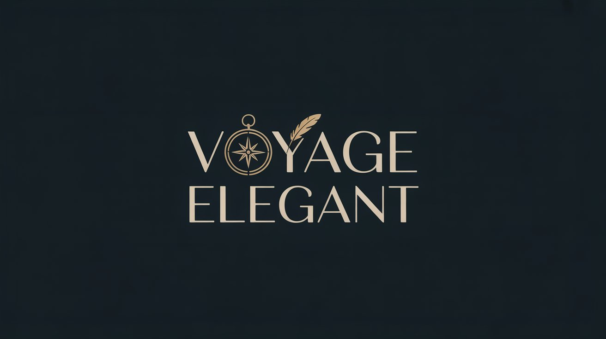

# Voyage Élégant 🌍✈️

> An elegant and modern travel agency website showcasing destinations, packages, and experiences worldwide.

[View Live Demo](https://mahmoud-ath.github.io/Websites/Projects_site/voyage_elegant/voyage_elegant.html) <!-- TODO: Add your live demo link -->




[](https://opensource.org/licenses/MIT)

## 📑 Table of Contents

- [About](#about)
- [Features](#features)
- [Screenshots](#screenshots)
- [Technical Details](#technical-details)
- [Installation](#installation)
- [Usage](#usage)
- [Contributing](#contributing)
- [Testing](#testing)
- [Deployment](#deployment)
- [License](#license)
- [Contact](#contact)
- [Roadmap](#roadmap)

## 🌟 About

Voyage Élégant is a sophisticated travel agency website designed to inspire wanderlust and facilitate memorable travel experiences. Built with modern web technologies, it offers a seamless and visually appealing interface for exploring destinations, booking packages, and discovering travel insights.

### Purpose

- To provide a user-friendly platform for travel enthusiasts to discover and book unique travel experiences
- To showcase curated travel packages and destinations with rich visual content
- To offer personalized travel recommendations and expert guidance

### Target Audience

- Travel enthusiasts looking for curated experiences
- Luxury travelers seeking premium destinations
- Adventure seekers exploring unique destinations
- Couples planning romantic getaways
- Travel agents and partners

## ✨ Features

- 🎯 **Modern Design** - Clean, responsive interface with Tailwind CSS
- 🌍 **Destination Showcase** - Featured destinations with stunning visuals
- 📦 **Travel Packages** - Curated travel packages with detailed information
- 🔍 **Category Exploration** - Easy navigation through travel categories
- 💬 **Testimonials** - Real customer reviews and experiences
- 📱 **Responsive Layout** - Perfect viewing on all device sizes
- 📰 **Travel Blog** - Insightful articles and travel tips
- 📸 **Instagram Integration** - Social media feed showcase
- 📧 **Newsletter** - Email subscription for exclusive offers
- 📞 **Contact Form** - Easy communication channel

## 📸 Screenshots


## 🛠 Technical Details

### Architecture

The website follows a modern static site architecture with dynamic features:

```
voyage_elegant/
├── index.html        # Main entry point
├── style.css         # Custom styles
├── script.js         # Interactive features
└── img/             # Image assets
```

### Tech Stack

- HTML5
- CSS3 (with Tailwind CSS)
- JavaScript (Vanilla)
- Font Awesome Icons
- Responsive Design
- Modern CSS Grid/Flexbox

### Libraries & Frameworks

- 🎨 [Tailwind CSS](https://tailwindcss.com/) - Utility-first CSS framework
- 📦 [Font Awesome](https://fontawesome.com/) - Icon library
- 🖼 [Unsplash](https://unsplash.com/) - High-quality images

### Local Setup
1. Clone the repository:
```bash
git clone https://github.com/mahmoud-ath/Websites.git
```

2. Navigate to project directory:
```bash
cd Websites
```

3. Open with a live server:
   - Using VS Code: Install "Live Server" extension and click "Go Live"
  

## 🚀 Usage

1. Browse through the destinations in the main section
2. Explore different travel packages and categories
3. Read travel blog posts and testimonials
4. Subscribe to the newsletter for updates
5. Contact through the form for inquiries

## 👥 Contributing

We welcome contributions to enhance Voyage Élégant! Here's how you can contribute:

1. Fork the repository
2. Create a feature branch: `git checkout -b feature/AmazingFeature`
3. Commit changes: `git commit -m 'Add AmazingFeature'`
4. Push to branch: `git push origin feature/AmazingFeature`
5. Open a Pull Request

Please read [CONTRIBUTING.md](CONTRIBUTING.md) for details on our code of conduct.

## 🧪 Testing

The website can be tested using:

- Browser Developer Tools for responsive design
- Lighthouse for performance metrics
- W3C Validator for HTML validation
- CSS Validator for style validation

## 📦 Deployment

The website can be deployed on any static hosting platform:

- GitHub Pages
- Netlify
- Vercel
- Firebase Hosting

Detailed deployment instructions for each platform will be added soon.

## 📄 License

This project is licensed under the MIT License - see the [LICENSE.md](LICENSE.md) file for details.

## 📞 Contact
Mahmoud Ath - [GitHub Profile](https://github.com/mahmoud-ath)

## 🗺 Roadmap

Future improvements planned:

- [ ] Add user authentication
- [ ] Implement booking system
- [ ] Add multi-language support
- [ ] Integrate payment gateway
- [ ] Add interactive maps
- [ ] Implement search functionality
- [ ] Add user reviews system
- [ ] Create admin dashboard
- [ ] Add virtual tour feature
- [ ] Implement AI travel recommendations

---

⭐️ Made with passion by [Mahmoud Ath](https://github.com/mahmoud-ath)

