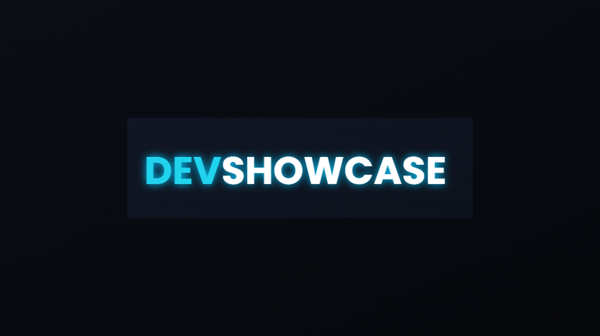
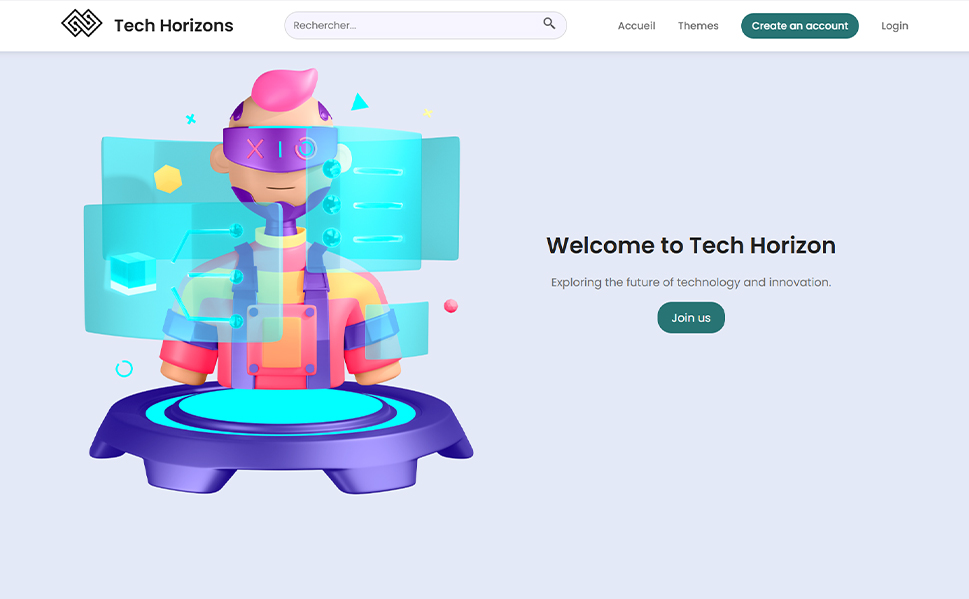

# Portfolio Showcase 🌟
> A modern, dynamic portfolio website showcasing web development projects with an interactive carousel interface.

## 📑 Table of Contents
- [About](#about)
- [Features](#features)
- [Screenshots](#screenshots)
- [Technical Details](#technical-details)
- [Installation](#installation)
- [Usage](#usage)
- [Contributing](#contributing)
- [Testing](#testing)
- [Deployment](#deployment)
- [License](#license)
- [Contact](#contact)
- [Roadmap](#roadmap)

## 🎯 About
### Purpose
This portfolio website serves as a showcase for web development projects, featuring an innovative and interactive interface that highlights various projects in different domains including e-commerce, data visualization, and web applications.

### Problem it Solves
- Provides a centralized platform to showcase multiple projects
- Offers an engaging user experience with modern UI/UX design
- Demonstrates technical capabilities through interactive elements
- Makes project discovery intuitive through a carousel interface

### Target Audience
- Potential employers and clients
- Fellow developers and collaborators
- Design enthusiasts
- Technology professionals

## ✨ Features
- 🎨 Modern, minimalist design with dark theme
- 🔄 Interactive project carousel
- 💫 Smooth animations and transitions
- 📱 Fully responsive design
- 🖼️ Project showcase with detailed descriptions
- 🌐 Cross-browser compatibility
- ⚡ Optimized performance
- 🔍 SEO-friendly structure

## 📸 Screenshots

## 🛠️ Technical Details

### Architecture
The project follows a clean, modular architecture with separate concerns for:
- Content structure (HTML)
- Styling (CSS)
- Interactivity (JavaScript)

### Tech Stack
- HTML5
- CSS3
- JavaScript (ES6+)
- Responsive Design

### Libraries & Frameworks
- Font Awesome (icons)
- Google Fonts (typography)
- AOS (Animate on Scroll)
- jQuery
- Bootstrap

## 🚀 Installation

### Prerequisites
- Modern web browser
- Text editor (VS Code recommended)
- Basic understanding of web technologies

### Local Setup
1. Clone the repository:
\`\`\`bash
git clone https://github.com/mahmoud-ath/Websites.git
\`\`\`

2. Navigate to project directory:
\`\`\`bash
cd Websites
\`\`\`

3. Open index.html in your browser or use a local server:
\`\`\`bash

## 🎮 Usage
1. Browse through projects using the carousel navigation
2. Click on project cards to view detailed information
3. Use navigation menu to explore different sections
4. View project demonstrations and live examples
5. Access contact information for inquiries

## 🤝 Contributing
We welcome contributions! Please follow these steps:

1. Fork the repository
2. Create a feature branch (\`git checkout -b feature/AmazingFeature\`)
3. Commit changes (\`git commit -m 'Add some AmazingFeature'\`)
4. Push to branch (\`git push origin feature/AmazingFeature\`)
5. Open a Pull Request

## 🧪 Testing
- Test responsive design across different devices
- Verify all links and navigation
- Check carousel functionality
- Ensure proper loading of images and animations
- Cross-browser testing

## 📦 Deployment
The website can be deployed to any static hosting service:
- GitHub Pages
- Netlify
- Vercel
- Firebase Hosting

Follow the hosting provider's documentation for specific deployment instructions.

## 📄 License
This project is licensed under the MIT License - see the [LICENSE](LICENSE) file for details.

## 📞 Contact
Mahmoud Ath - [GitHub Profile](https://github.com/mahmoud-ath)

Project Link: [https://github.com/mahmoud-ath/Websites](https://github.com/mahmoud-ath/Websites)

## 🗺️ Roadmap
### Phase 1: Essential Website Structure
- [ ] Setup basic project structure
  - [ ] HTML foundation
  - [ ] Core CSS styling
  - [ ] Basic JavaScript functionality
- [ ] Implement responsive design
  - [ ] Mobile-first approach
  - [ ] Breakpoints for different devices
- [ ] Create carousel component
  - [ ] Basic sliding functionality
  - [ ] Touch support
  - [ ] Navigation controls

### Phase 2: Project Integration
- [ ] Add MarkusPub website
  - [View Demo](https://mahmoud-ath.github.io/Websites/Projects_site/MarkusPub/index.html)
- [ ] Add BrandFlux website
  - [View Demo](https://mahmoud-ath.github.io/Websites/Projects_site/BrandFlux/index.html)
- [ ] Add CoachPro website
  - [View Demo](https://mahmoud-ath.github.io/Websites/Projects_site/coachPro.html)
- [ ] Add StockMasterPro website
  - [View Demo](https://mahmoud-ath.github.io/Websites/Projects_site/StockMasterPro.html)
- [ ] Add VoyageElegant website
  - [View Demo](https://mahmoud-ath.github.io/Websites/Projects_site/voyage_elegant.html)

---

Made with ❤️ by [Mahmoud Ath](https://github.com/mahmoud-ath)
